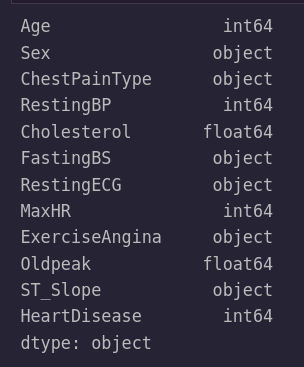

# Heart Disease Prediction

## An analysis of various medical features and how they relate to Heart Disease

### Rose Tovar

#### RoseATovar@gmail.com

### Objective

This project took a look at various features related to heart disease so we can predict if a person has heart disease or not. Part 1 of the project looked at exploration of the data using univariate visualizations. Part 2 looked at running different classfication machine learning models to find which model gave us the best results in reducing false negatives. Part 3 had us looking at using feature engineering techinques like PCA to possibly improve the results.

### Data

The Dataset for this project orginated from kaggle

https://www.kaggle.com/datasets/fedesoriano/heart-failure-prediction

This data contains multiple numeric and categorical data. The numeric data looks at Age, Resting Blood Pressure, , Cholesterol, Max Heart Rate, and Old Peak. While our categorical data that was used to in our models was Sex, Chest Pain Type, Fasting Blood Sugar, Resting ECG, Exercise Angina, and ST Slope.

### Methods

In this data we saw that one row contained multiple zeros and this removed. We also saw that cholesterol was 0 for 171 rows. After doing research this number was deemed to be an error and was replaced using the mean so that mean the column would be preserved.

### Insights

#### Average Oldpeak for Heart Disease

> To understand this graph we first must understand what Oldpeak is. Oldpeak is the depression of the ST Segment on an EKG. This shows us that indiviudals with heart disease have on average a olpeak of around 1.2. While those wtihout oldpeak have an oldpeak around 0.4. This tells us that oldpeak is can be explored as prominent feature in predicting heart disease in some indivudals.

#### Average Oldpeak for ST Slope

> This plot futher explores oldpeak; which is the depression of the ST Segment on an EKG. This time we evaluated the the average Oldpeak based on the type of ST Segment the indidvual has. A lower Oldpeak is seen for those without heart disease

### Model

The final model recommended for this project is a KNN model. This model was chosen because it gave us the highest ROC curve with 93% on the testing data. Anther important aspect was that it had minimum False Negatives. This is important because we do not want to tell an individual that they do not have heart disease when they actually do. This model gaves us a precision of 92% and a recall of 88% for having heart disease which was in line with many of other models used in the project.

### Recommendations

Recommendations for this project would include talking to a subject matter expert on Heart Disease. This would be beneficial with Feature Engineering and determining what we could add as a feature or remove to better enhance the performance of the model.

### Next Steps

Next steps include reaching out to a subject matter expert in the field and going over my results and figuring out what feature engineering that should be looked at to better enahcne the model and create features that may be a better fit in determining if an individual has heart disease or not.
